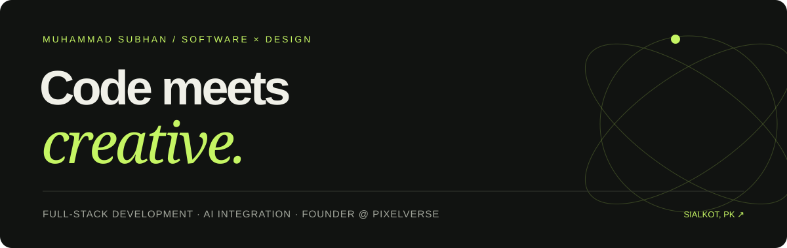

  

  
  
  

### Hi, I’m Subhan 👋

**A full-stack developer, AI builder and creative strategist based in Sialkot, Pakistan.** I’m studying Computer Science at the **University of Sialkot** and leading **PixelVerse**, my social media and design agency.

I enjoy the whole journey: understanding a problem, shaping the experience, writing the code and getting the details right. My work spans restaurant websites, local AI characters, multi-agent debate experiments and brand design.

- **Building:** responsive web experiences and AI-integrated applications.
- **Exploring:** local inference, structured prompts and multi-model workflows.
- **Leading:** creative direction, client strategy and delivery at PixelVerse since September 2024.
- **Connecting:** software engineering with visual identity and practical business needs.

## ✦ Selected work

| Project | What it explores | Built with |
|---|---|---|
| [**DeezYap**](https://github.com/subhanmiaan/DeezYap-MultipleAIDebateModel) | Parallel AI drafts, cross-critique and judged synthesis. Provider-backed agents and disclosed simulated personas. | React, TypeScript, Vite, Express, Gemini |
| [**Pay’In Ijaz**](https://github.com/subhanmiaan/Pay-in-Ijaz-AI-ChatBot) | A Punjabi mechanic-inspired chatbot running locally after setup. | Python, Streamlit, Ollama |
| [**BuntySajji**](https://github.com/subhanmiaan/buntysajji) | A desi restaurant experience with menu search, portion choices and truck-art accents. | HTML, CSS, JavaScript |
| [**Stash Pizza**](https://github.com/subhanmiaan/RestaurantsMenuAndOrderService2) | An eight-page restaurant site with a red-and-white identity and animated interactions. | HTML, CSS, JavaScript |
| [**GOODFILLERS**](https://github.com/subhanmiaan/RestaurantsMenuAndOrderService) | A motion-rich restaurant demo, from menu discovery to simulated checkout. | HTML, CSS, JavaScript |

Restaurant ordering flows are demos, not live payment or fulfillment systems. AI experiments document their provider requirements and limitations in their repositories.

[**Browse all repositories →**](https://github.com/subhanmiaan?tab=repositories)

## 🛠 Toolkit

| Area | Technologies & practices |
|---|---|
| **Frontend** | React · Next.js · JavaScript · TypeScript · Tailwind CSS · Responsive UI |
| **Backend & data** | Node.js · REST APIs · SQL · Supabase / PostgreSQL |
| **AI & local models** | Python · Streamlit · Ollama · Gemini · Groq · Prompt engineering |
| **Engineering foundations** | C · OOP · Data structures · Database systems · Linux · Git |
| **Creative & business** | Graphic design · Visual identity · Content strategy · Social media · Agency leadership |

## ↗ Experience & learning

**Founder / CEO — PixelVerse**  
*September 2024–present · Sialkot, Pakistan*  
Lead creative and technical operations, shape brand direction, manage client strategy, and improve delivery through AI-assisted workflows.

**BS Computer Science — University of Sialkot**  
*In progress · Faculty of Computing & IT*  
Coursework includes data structures, database systems, operating systems, HCI and mobile application development.

**Prompt Engineering — Coursera**  
*December 2023–January 2024*  
Structured prompt patterns for problem-solving, development and creative work.

## 📄 Choose a CV

| Focus | Download |
|---|---|
| **Software & AI engineering** — full-stack projects, integrations and technical skills | [Software Engineer CV](./Muhammad_Subhan_Software_Engineer_CV.pdf) |
| **Creative & management** — design, brand strategy and agency leadership | [Graphics & Management CV](./Muhammad_Subhan_Graphics_Management_CV.pdf) |

## Let’s build something useful.

Have a project, collaboration or role in mind? **[Email me](mailto:wsubhan5969@gmail.com)** or explore **[PixelVerse](https://www.instagram.com/pixelverse.io/)**.

---

Independent thinking. Hands-on building. Care for the final details.

